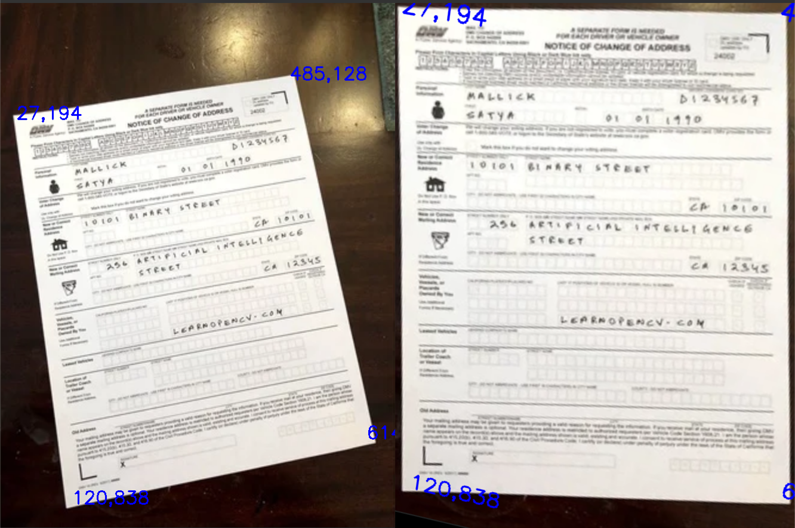
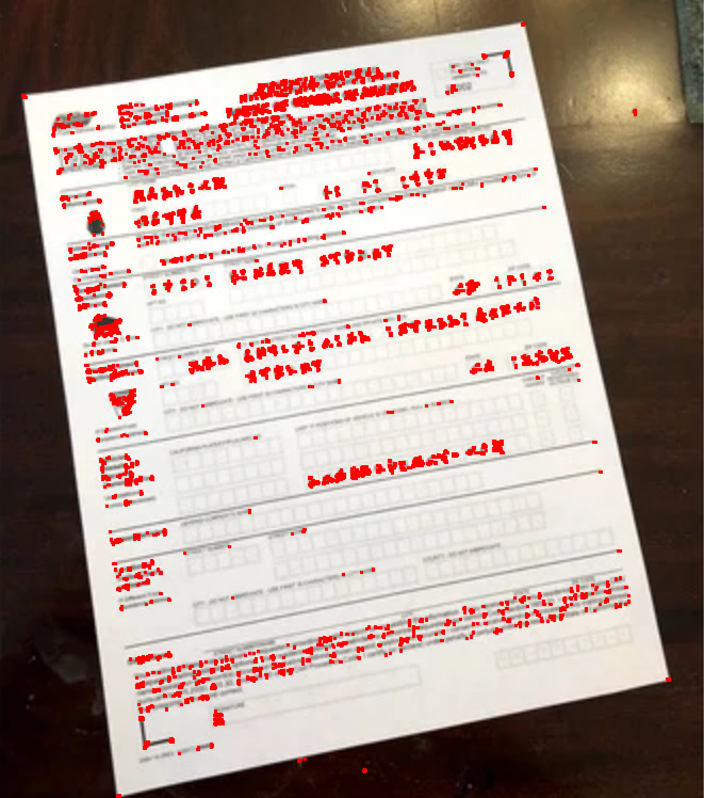
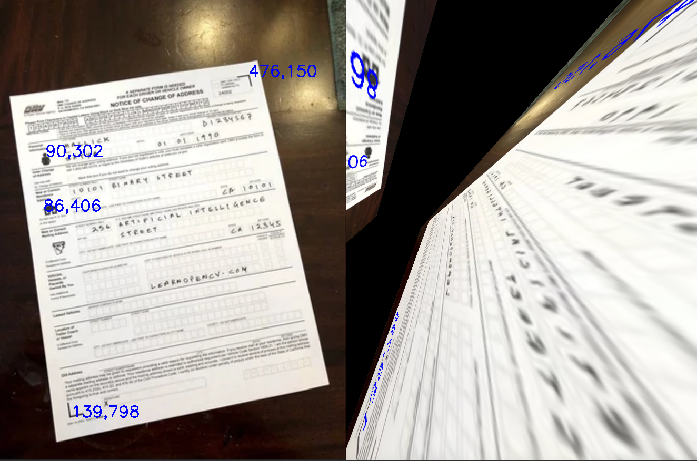

# Image Vision

## Image Registration

You are given a set of images, of which one of the images is designated as the _reference image_. The remaining images are referred to as the _target images_. _Image registration_ involves re-sampling the target images so that they are in the same coordinate system as that of the reference image.

# Input

1. Two images of the same object on different planes

# Output

1. Four images. (2 Using Manual Registration, 2 Using Automatic Registration)

# To Run Code

1. Place images in folder location of code.
2. Run ` python imageregistration.py -reg *image1* -ref *image2* ` 
3. For manual registration - select at least 4 corners on the source (reg) image. Press the space bar to progress to next image. Select the same number of points on the test (ref) image.
4. For automatic registration – no action necessary. Program will detect multiple points and perform transformation.

# Reflection 

Image registeration heavily relies on the important feature or points selected and passed to compute the projective homography. When comparing the points selected by Harris Corner to the points selected by the user, there seems to be one to no common points chosen. Users are more inclined to pick edges or corners of the object rather than precise points of a feature.For the provided solution, on running multiple tests we did notice that choosing edges, preferrably having a point chosen on each edge of the subject in the image provides the best feature matching with the minimum number of points. On selecting a point on features in the image, there seems to be a lack of accuracy in making sure the same feature point is actually chosen on both the images. When we account for this lack of accuracy which is expected by the user it doesnt let us compute a correct projective homography. 

We can observe this in the below image 
  

And the following are the points selected by Harris Corner 
  

Now re registering the image picking out 3 or 4 points idenitified by Harris Corner, we can see that the accuracy is quite off and the outcome is not eactly what is expected. 
  

  

As we can see from the above example when slecting a minimum number of points on more intricate features within an image, it doesnt seem to be accurate enough to compute a projective homography that gives us an optimal output.
